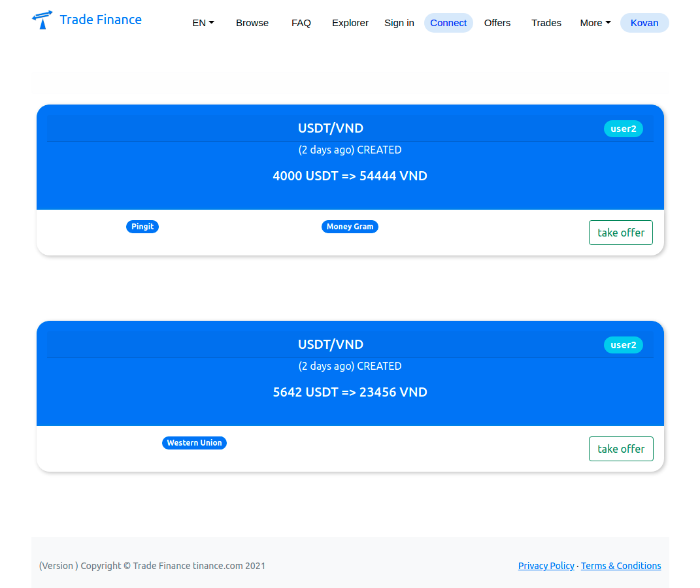
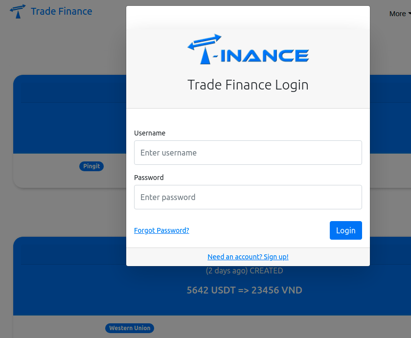
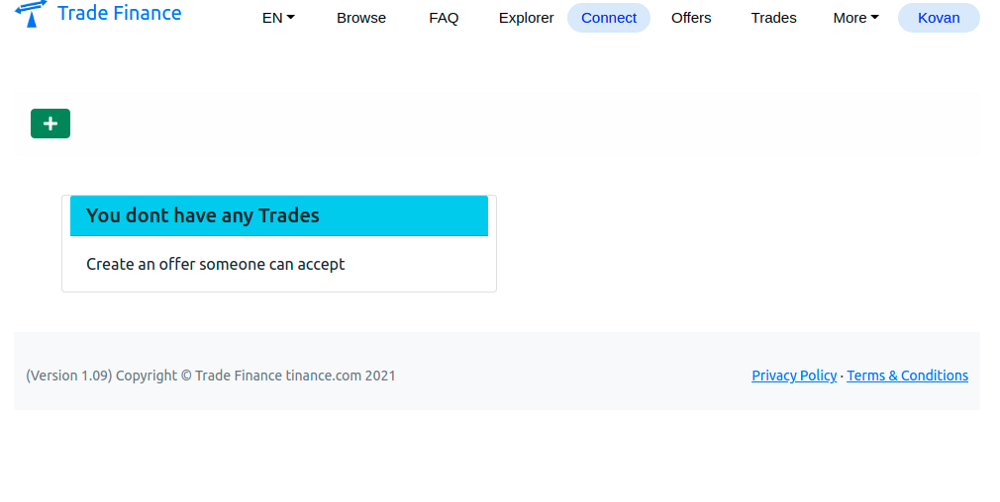
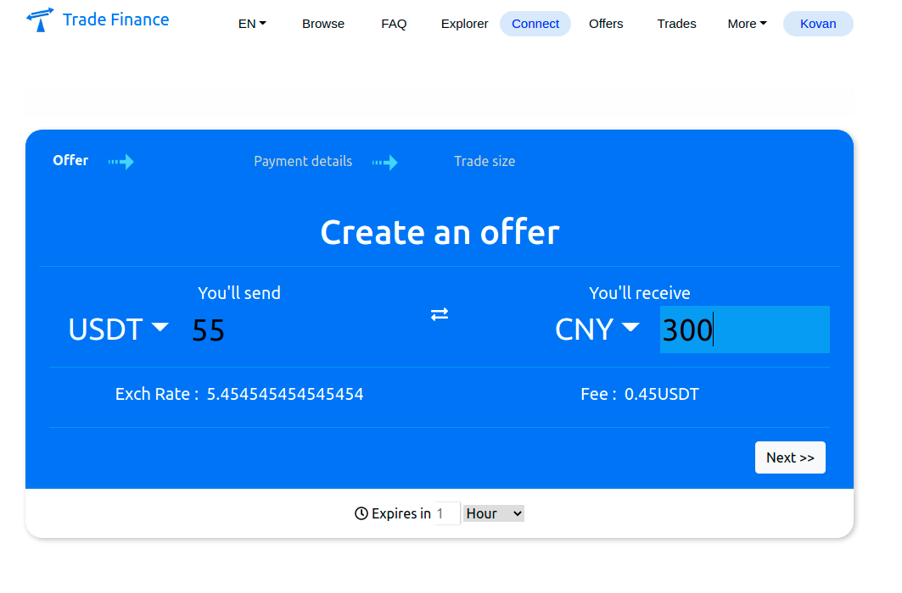

# Tinance UI project

We have a Java/SpringBoot based system that delivers a service using json calls. At the moment we use jsp & js, but the user experience is not great.

The site needs converting to use React/jsx as a single web page UI where content and authenticated data is taken from our Java system.

In the legacy folder, we have some working code to present the application as a single javascript module and a html page with supporting dom elements.
We have a simple menu with a set of functions, which should be replaced by React router (see diagram below)

1. The first task is to get this project working as a React SWP given the legacy code as the example. 

Completion is defined when we can 'npm start' the 'tinance-ui' folder and it will run the same way as the legacy example.

We have JWT REST architecture inplace, so developing authentication and calls with JWT would be needed.

To view

```
git clone (this repository)
```
and open your browser at the legacy file

```
TinanceUI\legacy\main.html
```
## Overview of pages and process



## Screen images





