# Tinance UI project

## History
We have a Java/SpringBoot based system that delivers a service using json calls. At the moment we use jsp & js, but the user experience is not great.

The site needs converting to use React/jsx as a single web page UI where content and authenticated data is taken from our Java system using jwt & rset API.

## Site-map


## Future gaol
We have a simple wireframe mock up of menu with a set of functions. We have a wireframe example of the functions

```https://balsamiq.cloud/sud7lfj/pecczo2/r2278```


## Our example app in html/js
In the /legacy folder, we have a basic example of the system.
The ```main.html``` is our single page app supported by ```bundle.js``` which calls functions and changes the DOM tree. (We are working on breaking down ```bundle.js``` into logical files for easier reading - to be updated in the next few days)

In summary, ```bundle.js``` contains:
* core functions
* menu functions
* functions to show and hide DOM elements

```bundle.js``` also calls our REST api to get data for the server


The REST API can be interactively browsed (Swagger) at 
```
https://tinance.techiaz.com/swagger-ui.html
```

## Public functions
Without login / authenticating, any client can view the public functions.

### jwt-public-data
* GET ​/v1​/public​/paymenttypes.json
    ** list of payment types that are available
* GET ​/v1​/public​/offers.json
* GET ​/v1​/public​/getprofilepublic.json
* GET ​/v1​/public​/ccycodes.json
* GET ​/v1​/public​/userTrades.json (**deprecated)


## Start page
```javascript
function pageStart()
```

We need to use session information acrosss all pages. The easiest way is to store the App data in a json cookie. If the user leaves the page and then returns, we can easily recover the data from the cookie.




```javascript
function browseOffers()
```
calls the REST API ```v1/public/offers.json``` and displays data as html


# Tasks 
1. The first task is to get this project working as a React SWP given the legacy code as the example. 

We would like to 'npm start' your 'tinance-ui' folder and it should run your development code.

To view our example

```
git clone (this repository)
```
and open your browser at the legacy file

```
TinanceUI\legacy\main.html
```

## Overview of pages and process


## Screen images


